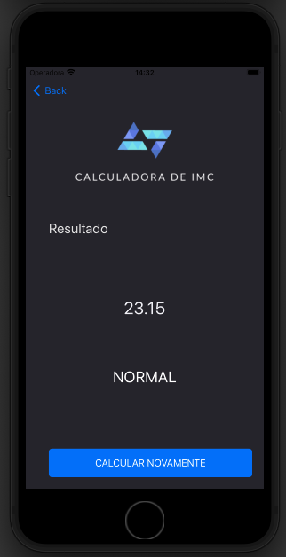

# imc-app-ios
<h2> IMC iOS APP </h2>

<h1 align="center">
    
🔗 CALCULADORA IMC

</h1>

🚀 Aplicação iOS para calcular o IMC.

<h1 align="center">
  
  
</h1>

### 🛠 Tecnologias

As seguintes ferramentas foram usadas na construção do projeto:

- [Xcode](https://developer.apple.com/xcode/)
- [Swift](https://developer.apple.com/swift/)

Feito com ❤️ por Fran Mazzarotto
